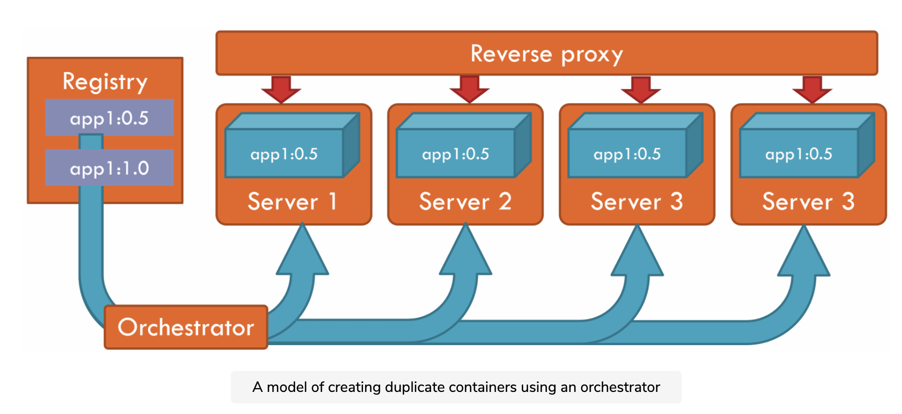

# Docker

## **Keywords**

**Docker Engine**: It is used for building Docker Images and creating Docker Container.

**Docker Hub**: This is the registry that is used to host various Docker images.

**Docker Compose**: This is used to define an application using multiple Docker containers. Design an orchestration of system

**Container →** is what Docker hosts

**What is Docker-server?** 

→ It is a host for many containers.

**Image** 

→ describes everything that is needed to create a container (a template of the container)

→ We can create as many containers from a single image.

**Docker Registry** → the place stores all the Docker images

# Install

## Ubuntu

[https://docs.docker.com/engine/install/ubuntu/](https://docs.docker.com/engine/install/ubuntu/)

- Grant current user in `group docker`, you don't need to use `sudo keyword` when using `docker CLI`:

```bash
sudo usermod -aG docker $USER
sudo apt install docker-compose
```

Before you install Docker Engine for the first time on a new host machine, you need to set up the Docker Repository. Afterward, you can install and update Docker from the repo.

- add a group for docker
[https://docs.docker.com/engine/install/linux-postinstall/](https://docs.docker.com/engine/install/linux-postinstall/)

List version available in your repo
`apt-cache madison docker-ce`

# Why Docker?

- **Solves Dependency conflicts**
    - Version change between the apps.
    
    → With docker, each container encapsulates its own dependencies.
    
- **Easy scaling up:**  → **With Docker, you can run as many containers as are required.**
    - Traditional solution: **place a reverse proxy in front of** it and duplicate the server as many times as needed → That is only going to make things worse when upgrading (you have to upgrade each server → make conflicts)
    
    → With docker, You have an orchestrator, you merely need to state how many containers you want and the image name, and the orchestrator creates that on all of your Docker servers
    
    
    
- **Seamless upgrades:** don't understand
    - [https://www.educative.io/module/page/LgoqGKFl7YxO2wNDm/10370001/5453871022342144/5979051033362432](https://www.educative.io/module/page/LgoqGKFl7YxO2wNDm/10370001/5453871022342144/5979051033362432)

# What is a `container`?

- The c**ontainer** is simply another process on your machine (it is isolated from all other processes on the host machine)
    - When we run a container → it uses an isolated filesystem (is provided by container image)
- `Dockerfile`  → used to build a container image
- To share Docker Image you have to use `a Docker registry`. (default registry is DockerHub)
- A container is a way to package an application with all the necessary dependencies and configurations.
    
    → It becomes a portable artifact so that packages can be easily shared and moved around
    

### Because the container is portable → we should consider:

- There must be some kind of storage for those containers so that we can share and move them around
    - At the company, they use their own private repository.
    - Another way is public repo is DockerHub.
- Benefits:
    - You do not have to install any of the services directly on your OS (because the container is an isolated operating system layer-based image → so you have everything packaged in one isolated environment.

## Tag image - version of the image - Why?

- Be able to roll back the previous version of an image if the latest image has a problem.
- Run different versions in different environments. For instance, the latest version run in a test environment and the previous version run in a production environment.
- Canary release: Run different versions at the same time, routing some users to the latest version and some to the previous versions.
- Deploy different versions to different users, and be able to run whatever version on your development machine while you support them.

→ In order to apply a tag, just state it during your build command:

`docker build -t hello:1.0 .`

## Share your Image

- `cstungthanh` is the username of the DockerHub account.
- Create a repository in DockerHub with the name: `project-name-hub`
    
    → cstungthanh/project-name-hub
    
- In your machine: you log in to DockerHub: `docker login -u cstungthanh`
- You need to tag the image in your machine (that you want to push to DockerHub to the repo)
    - `docker tag image-name cstungthanh/project-name-hub`
    - using `docker image ls` to show the current image names.
- `docker push cstungthanh/project-name-hub`

## Size matters - Why the size of an image is important?

- reduce pull and push times
- Use a minimum amount of space in the registry
- Use a minimum amount of space on the machines that will run the containers / or create the image.

→ There are 3-main-factors that affect your image size:

1. **The files included in your image:** 
    1. Just include only necessary files→ try to be as precise as possible.
    2. However, you want to exclude files from that copy → you can use `.dockerignore`
2. **the basic image size**: there are variant tags of images you can use. For instance, using `alpine` have a smaller size than the normal
3. I**mage layers:**
    1. Each instruction in your DockerFile results in a new image layer being created → added to your local image cache
    2. → Every command in DockerFile represent one step → it will be cached at the initial running → so the second running if this step has already run in the first time, the docker engine will get the result from cache storage without running again
    3. → It might be producing bugs: because some instruction like COPY → it is cached, but at the new version we change files that are copied → It will not change in the new image because the old result is being cached

# Flow

- **Create a new Image**
    1. Define Dockerfile
    2. Build image → run: `docker build for-that Dockerfile`
    
    → After this step, you have an image in local machine
    
- **Run container**
    
    using docker run command:
    
    - docker engine will check the image is exist in the local machine
    - If not it will pull from the docker registry.
    
    `DockerFile` -*build*→  `image`  -*run*→ `Container`
    

# Notation

- If you want to re-build the app, you need to stop the running container and build the app again. (if not it'll run on another port on your machine)
- file `.dockerignore` cũng nên được coi trọng. File này giúp docker biết phải loại bỏ file nào ra khi build image. Điều này 1 là giúp các bạn loại trừ được file chứa dữ liệu (logs, config local,...) ra khỏi image, 2 là giúp giảm nhẹ dung lượng image khi docker chỉ build image bằng các file cần thiết. File này có nội dung gần giống như .gitignore vì những file dc ignore bởi git thì cũng thường nên được ignore bởi docker. Dưới đây là 1 ví dụ file .dockerignore với project nodejs:

---

# Commands

- `docker run -dp 80:80 image-name`
    - `-d:` detach → run container in the background
    - `-p:` publish → map port `port_container:port_your_machine`
    - `--rm`: remove→ the container is deleted once it has stopped
- `docker ps -a` to show all the containers in your machine
    - -a: show the container has stopped.
- `docker build -t image-name .`
- `docker stop Container-ID`
- `docker rm Container-ID`
- *`docker logs`*: retrieves the logs of a container, even when it has stopped
- `docker inspect`: gets detailed information about a running or stopped container
- `docker stats`: monitoring - collecting your logs and providing usage statistics.

---

# Syntax in `Dockerfile`

- FROM: specifies which base image the current image is based on
- ENV: set environment variables
    - `ENV name=value`
- CMD: execute the command
    - `CMD node index.js`
- COPY:
    - `COPY source target` → `COPY index.js ./`
- 

---

Volumes - Persist the data in DB  

- When the containers do something (create, update..) those changes are lost when the container is removed and all changes are isolated to that container.
- `Volumes` provide the ability to connect to `specific filesystem paths` of the container to the host machine.
- There are two types to persist the data:
    1. named volume
    2. bind mounts

---

# Volume

### 1. Named volume

- Named volume is great if you want to store data, as we don't have to worry about where the data is stored on the disk.
- `named volume` as a bucket of data. Docker maintains the physical location on the disk
- Steps:
    - Create volume: `docker volume create todo-db(volume-name)`
    - Run the container: `docker run dp 3000:3000 -v todo-db:/etc/todos image-name`

---

### 2. Bind mounts

- With Bind mounts, we control exactly the mount-point on the host.

```bash
docker run -dp 3000:3000 \
     -w /app \
		 -v "$(pwd):/app" \
     image-name \
     sh -c "yarn install && yarn run dev" // commands will run after run the container
```

- -dp: run in detached mode and create  a port mapping
- - w: working directory
- -v: binds mount the current directory in the container to the /app directory

> If you have installed and used the `nodemon` when we are running the app through docker. When you alter(modify) the code it will immediately restart the application.
> 

---

# Container networking

> Remember that the container runs on an isolated process, so it doesn't know anything about other processes or containers on the same machine
> 

How do we allow one container to talk to another?

> **Rules**: If two containers run on the same `network`, they can talk to each other. If they aren't, they can't.
> 

What is the network here?

There are two ways to put a container on a network:

- assign it at the start
- connect to an existing container

The reference here: [https://docs.docker.com/get-started/07_multi_container/](https://docs.docker.com/get-started/07_multi_container/)

---

# Docker-compose

### What is docker-compose?

It is a tool designed for helping and sharing **multi-container applications**.

- We can create a YAML file to define services with a single command.
- You can define your stack application in a file → someone who just clone your repo and start the composing app

```yaml
# docker-compose.yml
version: "3.7"
services:
  app:
    image: node:12-alpine
    command: sh -c "yarn install && yarn run dev"
    ports:
      - 3000:3000
    working_dir: /app
    volumes:
      - ./:/app
    environment:
      MYSQL_HOST: mysql
      MYSQL_USER: root
      MYSQL_PASSWORD: secret
      MYSQL_DB: todos

  mysql:
    image: mysql:5.7
    volumes:
      - todo-mysql-data:/var/lib/mysql
    environment:
      MYSQL_ROOT_PASSWORD: secret
      MYSQL_DATABASE: todos

volumes:
  todo-mysql-data:
```

---

continue at [https://docs.docker.com/get-started/09_image_best/](https://docs.docker.com/get-started/09_image_best/)

[Set up project](https://www.notion.so/Set-up-project-32a6c63c02944a66b76958a39a330589)